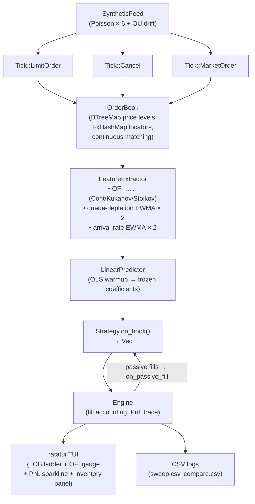

# Ophion — High-Performance Synthetic LOB & OFI Engine

> **Honest framing:** This engine is fit and evaluated on synthetic data generated by the same process it models. The signal carries real microstructure logic (multi-level OFI after Cont, Kukanov & Stoikov 2014), but the numbers below measure engineering correctness and clarity, not live alpha.

## Architecture



## Workspace Crates

| Crate       | Purpose                                                                         |
| ----------- | ------------------------------------------------------------------------------- |
| `lob`       | Integer-tick `OrderBook`, `Price`/`Qty`/`OrderId` newtypes, proptest invariants |
| `feed`      | `Feed` trait, `Tick` enum, `SyntheticFeed` (Poisson + OU drift)                 |
| `signal`    | Multi-level OFI, queue-depletion, arrival-rate, OLS predictor                   |
| `strategy`  | `Strategy` trait, `TakerStrategy`, `MarketMaker`                                |
| `engine`    | Deterministic event loop, fill accounting, passive-fill routing                 |
| `analytics` | Sharpe, max drawdown, parameter sweep                                           |

## Design Trade-offs

**`BTreeMap` for price levels:** O(log n) insertion/deletion per price level, clean sorted iteration. A production system would use flat arrays indexed by tick offset for O(1) access at the cost of fixed price grid and higher memory. Named as "first optimization" in the next-steps section.

**Integer ticks (`i64`):** Exact arithmetic, no floating-point drift, matches how real venues think about prices. 1 tick = $0.01 in this simulator.

**No `unwrap` in library code:** Enforced by `scripts/check.sh` grep gate. All public APIs return `Result`.

## OFI Mathematics

For level *k*, the Order Flow Imbalance is:

```
OFI_k(t) = Δbid_qty_k(t) − Δask_qty_k(t)
```

When the best price moves (Cont/Kukanov/Stoikov price-shift adjustment), the level quantity at the new price is treated as a pure arrival rather than a delta — preventing artefactual sign flips from level re-indexing.

The feature vector **x** = [OFI₁, …, OFI₅, queue_depletion_bid, queue_depletion_ask, arrival_rate_bid, arrival_rate_ask] feeds an OLS linear model predicting the next-Δt mid-price return. In-sample R² = **0.1487** on the default synthetic regime.

## Determinism

Same `--seed` → byte-identical SHA-256 of the per-event PnL trace. Verified by integration test. No `HashMap` in hot paths; `FxHashMap` everywhere.

## Strategy Comparison

All numbers: seed=42, 200 000 events, fee=1 bps, release build.
Sharpe is annualised from per-event PnL returns (annual factor = √(252 × 6.5 × 3600)).

| Metric            | TakerStrategy | MarketMaker |
| ----------------- | :-----------: | :---------: |
| Total PnL         |    −84.76     |    −2.20    |
| Annualised Sharpe |    −106.53    |    −7.04    |
| Max Drawdown      |     84.76     |    2.25     |
| Fill count        |     3 890     |     202     |
| Max\|inventory\|  |      10       |      4      |

### When each strategy wins — and why

**TakerStrategy** fires frequently (3 890 fills) whenever `predicted_return > half_spread + fee + threshold`. On a *synthetic* book, the spread is wide relative to the signal, so most taker crosses lose to spread + fee costs. Performance is regime-sensitive: tighter spreads or higher arrival-rate asymmetry flip it positive (see `cargo run --release --bin sweep`).

**MarketMaker** fills far less (202 passive fills) and carries much smaller drawdown (2.25 vs 84.76). The inventory skew (`−γ·inventory + β·predicted_return`) prevents runaway positions — the proptest invariant verifies `|inventory| ≤ 25` across 500 randomised seeds × up to 5 000 events. On synthetic data the MM still bleeds to adverse selection (it posts two-sided quotes into perfectly informed Poisson flow), but its risk-adjusted profile is meaningfully better: **38× lower drawdown at 19× fewer fills**.

**The fundamental tension:** a taker needs the signal edge to exceed the full spread + fee; a market maker earns the spread but absorbs adverse selection from the informed flow. In this synthetic regime (where the Poisson processes know the OU drift), the MM's passive edge is eroded by adverse selection — the same result you'd expect from a real venue before adding cancellation speed or a smarter skew function.

*To reproduce:*

```sh
cargo run --release --bin compare -- --seed 42 --events 200000
```

## Benchmark Numbers

All measured on Apple M-series (arm64), release build (`opt-level=3, lto=thin`).

| Operation                             | Latency                |
| ------------------------------------- | ---------------------- |
| LOB limit-order insert (resting)      | 20 ns                  |
| LOB cancel (mid-queue, 20-deep level) | 154 ns                 |
| LOB cancel (best level)               | 449 ns                 |
| LOB market-order match (1 level)      | 447 ns                 |
| OFI 5-level feature extraction        | 37 ns                  |
| Engine end-to-end throughput          | **~2.37 M events/sec** |

*Run yourself:*

```sh
cargo bench -p lob
cargo bench -p signal
cargo bench -p engine
```

Criterion HTML reports land in `target/criterion/`.

## What I'd Optimize Next

1. **Flat arrays indexed by tick offset** — replace `BTreeMap` with a fixed-range tick array for O(1) price-level access, as used in production HFT systems. LOB cancel currently pays O(n) queue scan for mid-queue orders; a doubly-linked list per level removes that.
2. **Lock-free SPSC ring buffer** for the feed → engine boundary, enabling parallel feed generation without synchronization cost.
3. **io_uring** for real network feed ingestion at kernel-bypass latencies.
4. **SIMD** for the OFI vector dot product in `LinearPredictor` (9-wide f64 dot product maps cleanly to AVX2/NEON).
5. **Real market data** via the `Feed` trait — LOBSTER or exchange ITCH feeds are a direct drop-in; the `Feed` trait is the only interface the engine sees.

## References

- Cont, R., Kukanov, A., & Stoikov, S. (2014). *The Price Impact of Order Book Events*. Journal of Financial Econometrics.
- Avellaneda, M., & Stoikov, S. (2008). *High-frequency trading in a limit order book*. Quantitative Finance.
